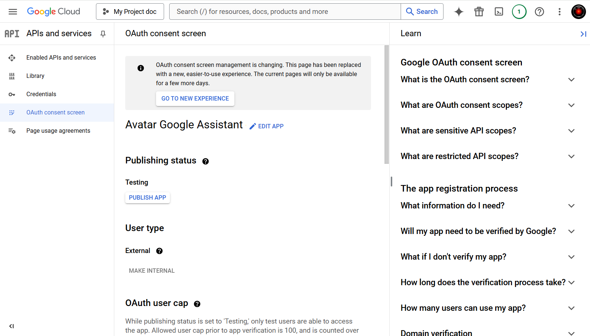
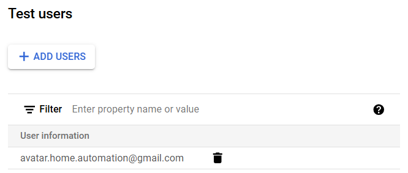

# 4. OAuth consent

Nous devons maintenant rendre l'application accessible pour les utilisateurs.

1. In the `APIs and services` page, clic on `OAuth consent screen`

    {width="650"}

2. In the `Test users` section, click on the `+ ADD USERS` button
3. In the `Add users` page, add your google email account
4. Click on the `SAVE` button
5. Your google email account appears in the `Test users` section

    {width="450"}

