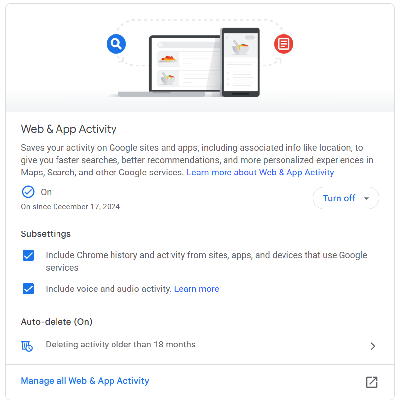

# 5. Activity related commands

Go to the [Activity control](https://myactivity.google.com/activitycontrols?utm_source=my-activity) page in your Google Account.

- Turn on the "Web & App activity"
- Include Chrome history, apps and devices  
- Include voice and audio activity 

{width="400"}

In this way, Google Assistant can access your personal information.

Now we need to configure the action client that will access the Google Assistant API.  
We'll do this in the step 5. `Registering a device`.