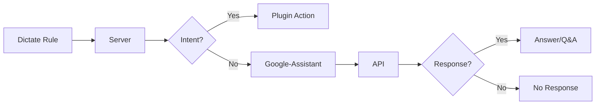

# Plugin Functionality Concept

Before using the plugin, it’s essential to understand a few fundamental concepts.  
Here’s how the `google-assistant` plugin operates:  

1. **Rule Dictation**: You dictate a rule to an A.V.A.T.A.R client.  
2. **Transmission to the Server**: The rule is transmitted to the A.V.A.T.A.R server.  
3. **Intent Search**: The server scans the installed plugins to identify an intent matching the rule.  
4. **Action Trigger**: If an intent is found, the associated action is executed.  

This process is standard and does not alter A.V.A.T.A.R's usual mode of operation.  

What’s new with the `google-assistant` plugin is what happens when **no intent is found**:  

1. The rule is forwarded to the `google-assistant` plugin.  
2. The plugin sends the rule to the Google Assistant API.  
3. Depending on Google Assistant’s capabilities, two scenarios may occur:  
   - **Simple Response**: For example, answering a question like "What time is it?".  
   - **Interactive Conversation**: If the Assistant asks a question, you can respond directly, allowing a back-and-forth exchange until the conversation ends.  

If Google Assistant cannot provide an answer, it will notify you.  

Here is a graphical representation of the concept behind the `google-assistant` plugin's operation:

### Integration with Existing Plugins  

Keep in mind that if you have plugins that handle the same functionalities as those you might request from Google Assistant, these plugins will take priority and respond instead.  
However, if you want Google Assistant to handle the request, you can disable the conflicting plugins. Conversely, keep them enabled if you prefer they manage the queries.  
