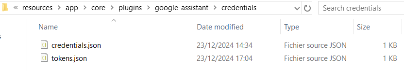

# 7. Grant access to Google assistant

The last step is to copy the access key files into the `google-assistant` plugin directory.

1. Open a Windows explorer and go to the folder where all files was created in previous steps (e.g. _c:\tmp\credentials_).
2. Select (and copy) the _credentials.json_ and _tokens.json_ files.
3. Go to the A.V.A.T.A.R `google-assistant` plugin directory.
4. Create a _credentials_ directory.
5. Paste the _credentials.json_ and _tokens.json_ files into the new _credentials_ directory:

    {width="650"}

6. Start (or restart) the A.V.A.T.A.R server.