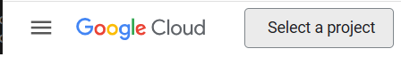
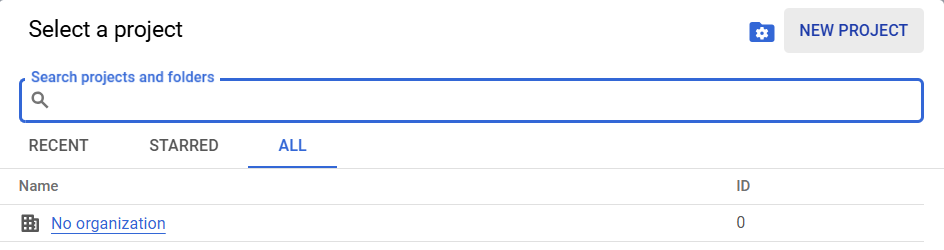
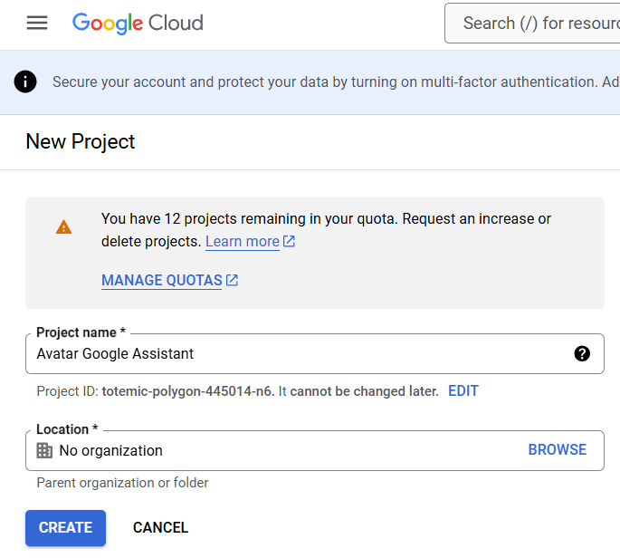
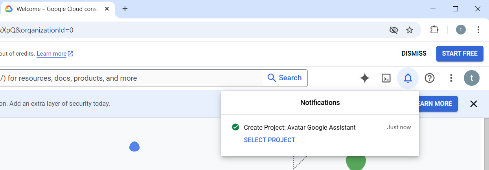
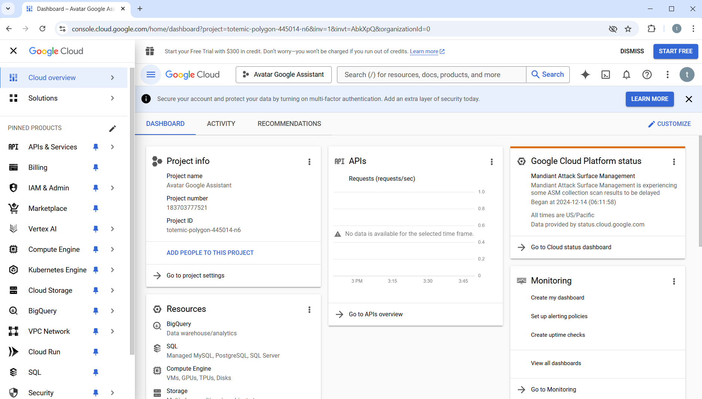

# 1. Create a Google assistant project

1. Open a browser internet and go to the [Google Cloud Platform](https://console.cloud.google.com)

    * If you have a Google account or already own devices, such as a Google Home, sign in with your Google Account.  
    
    ???+ tip
        Using the Google account that was used for a Google Home (or other devices) will allow you to control them with A.V.A.T.A.R.
    
    * Otherwise, create a new account.

3. On top of the window, click on the `Select a project` button

    {width="300"}

4. In the new window, click on the `NEW PROJECT` button

    {width="450"}

5. Enter a name for your project (e.g. _Avatar Google Assistant_)

    {width="450"}

6. After a few seconds, the project is created

    {width="600"}

7. Click on the `SELECT PROJECT` button

    {width="600"}

8. Make sure that the project is selected as current project and go to the step 2. "Adding Google Assistant API"