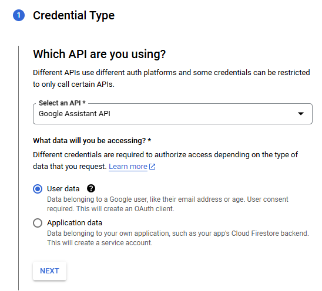
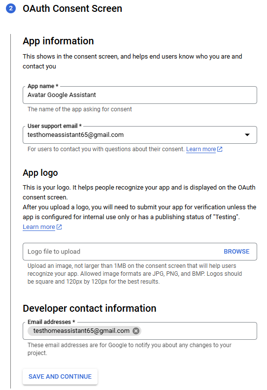
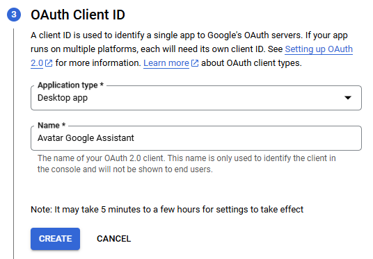
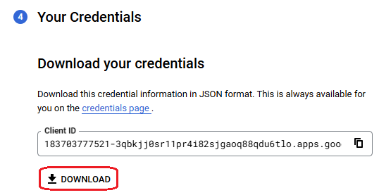
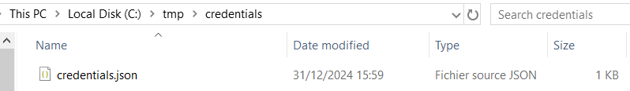
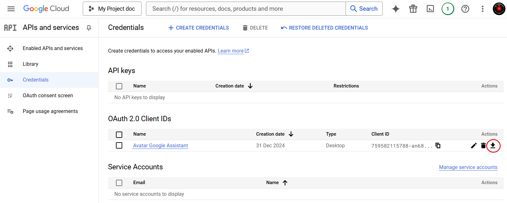

# 3. Create credentials

1. In the "API/Service Details" window and at the top right-hand corner, click on `CREATE CREDENTIALS`
2. The `Create credentials` window appears
3. **Step 1 - `Credential Type`**

    - Select `User data`
    - Click on `NEXT` button

    {width="450"}

4. **Step 2 - `OAuth Consent Screen`**

    - Enter an App name (e.g. _Avatar Google Assistant_)
    - Select your Email adress as `User support email`
    - Enter your Email adress as `Developer email`
    - Click on `SAVE AND CONTINUE` button

    {width="450"}

5. **Step 3 - `Scopes`**

    - This step is optional, click on `SAVE AND CONTINUE` button

6. **Step 4 - `OAuth Client ID`**

    - In the Application type, select `Desktop app`
    - Enter a name (e.g. _Avatar Google Assistant_)
    - Click on `CREATE` button

    {width="450"}

7. Step 5 - `Your credentials`

    - Download your credentials by the `DOWNLOAD` button.

        {width="400"}

    - Create a directory where you want (e.g c:/tmp/credentials)
    - Copy the credentials file to this directory and rename it to _credentials.json_

        {width="450"}

    - Click on `DONE` button

8. The "OAuth 2.0 Client IDs" is created, you can see it to the `Credentials` page

    {width="750"}

    ???+ tip
        If you want, you can also download the `Credentials` file on this page.