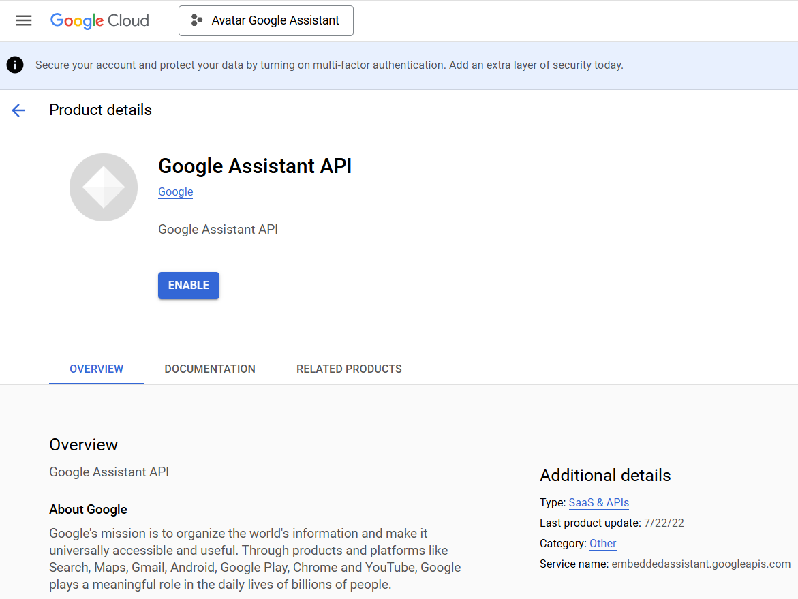
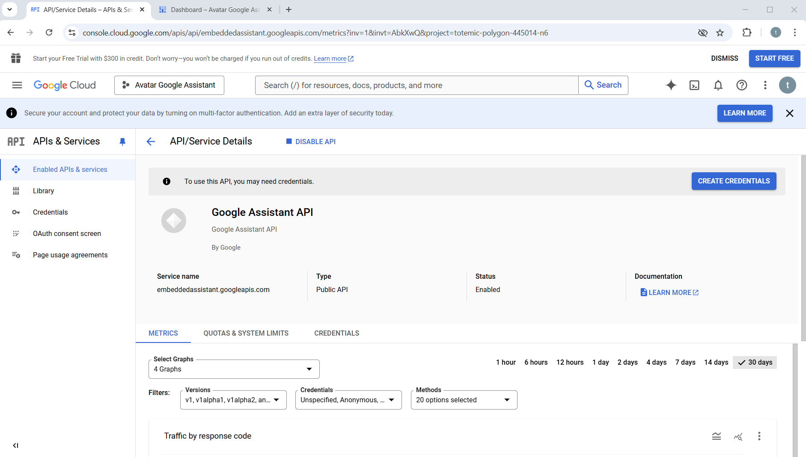

# 2. Add Google assistant API

1. Do a right click on [this link](https://console.developers.google.com/apis/api/embeddedassistant.googleapis.com/overview) and in the menu click on `Open link in a new tab` to open a new window.
2. A new window opens with the Google Assistant API librairy

    {width="600"}

3. Click on the `ENABLE` button
4. The dashboard of the Google Assistant API appears

    {width="600"}

5. Go to the step 3. "Creating Credentials"