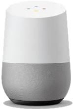

# Welcome to Google Assistant for A.V.A.T.A.R!

    
    <h2 style="margin: 0;">A World of Possibilities at Your Fingertips</h2>

Imagine being able to ask any question or control your smart home directly from A.V.A.T.A.R. With this plugin, this vision becomes a reality through the seamless integration of Google Assistant.

Do you have a connected device without an API but integrated with Google Assistant? Want to include it in a scenario alongside other actions, like those from your smart home hub or custom-built routines? Or even define the exact phrase that triggers this scenario?

Thanks to this plugin, A.V.A.T.A.R becomes even more versatile, blending your personalized needs with the power and flexibility of Google Assistant. Whether it's answering a simple question or interacting with a wide range of connected devices, Google Assistant is the perfect ally to enhance A.V.A.T.A.R’s capabilities.

### Get Instant Answers to Your Questions
Want to check the weather? Just say:  
"What's the weather today?" and get an immediate response.

### Control Your Smart Home
Turn on the lights, adjust the thermostat, or activate your smart devices.  
For example: "Start vacuuming the living room."

### Enjoy Entertainment and Information
Get the latest news or play interactive games like a quiz or Guess the Number.  
Ask A.V.A.T.A.R to tell your kids a story or crack a joke to brighten your day.

Ready to get started? Follow the [installation guide](introduction.md) to integrate Google Assistant into A.V.A.T.A.R and unlock endless possibilities!
