# 6. Register a device

A.V.A.T.A.R does not require the Python SDK to use Google Assistant.
You can therefore install the Python SDK on a different machine than the one where A.V.A.T.A.R is installed, for example, a development machine.

However, the SDK is essential for installation and is only used to:

* Register a Device
* Retrieve an access key for the Actions client

## Install Python
First, install [Python 3](https://www.python.org/downloads/) on your machine.

???+ warning
    Click the checkbox 'Add Python to environment variables' to run Python from any directory; otherwise, you will need to execute commands from its installation directory.

1. Check if Python is correctly installed by opening a DOS terminal.
2. Enter the following command 

    ```
    python --version
    ```

    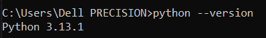{width="300"}

    ???+ warning
        If you have an error message, it means that Python is not in the environment variables.  
        Resolve the problem by adding Python to the environement variables or reinstall it (do not forget to select 'Add Python to environment variables')
    

## Install google-auth librairies

In the DOS terminal, enter the following command to install the google-auth librairies

```
pip install google-auth google-auth-oauthlib google-auth-httplib2
```

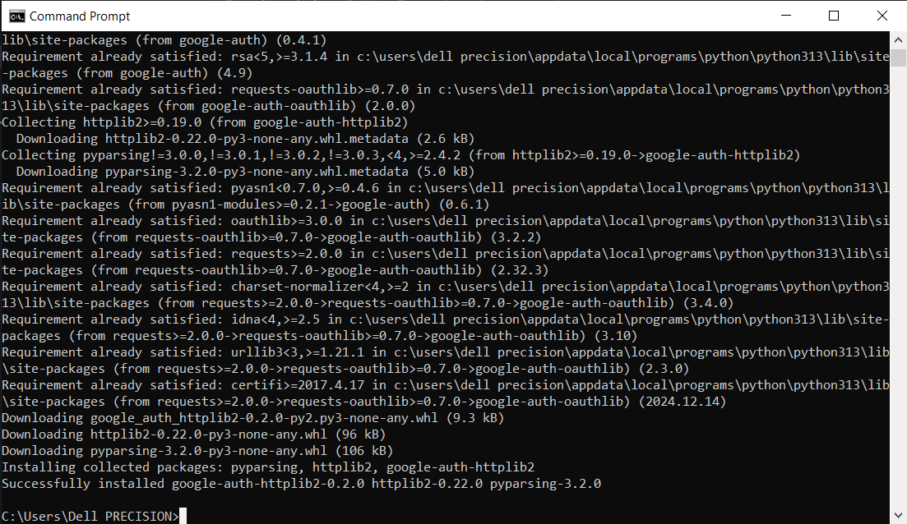{width="500"}


## Obtain credentials

1. Obtain credentials to be able to create a new device model. 
    Reference the _credentials.json_ file you copied in the previous step 3. `Creating Credentials`.

    ``` python
    cd /tmp/credentials
    ```
    ```
    google-oauthlib-tool --client-secrets C:\tmp\credentials\credentials.json --scope https://www.googleapis.com/auth/assistant-sdk-prototype
    ```

2. Because the projet created in the step 1 is in testing mode, the following warning message appears

    * Clic the `Continue` button

    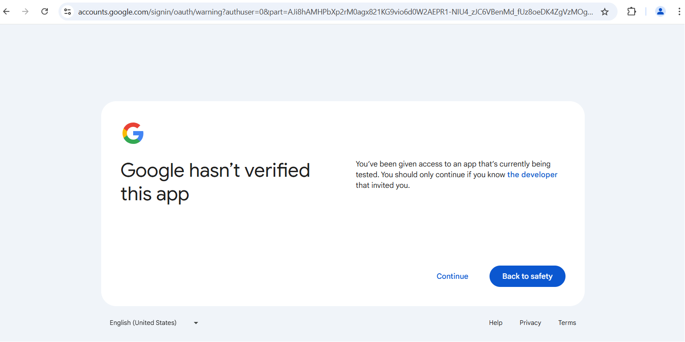{width="500"}

3. A new page appears to grant your project access to your Google account.

    * Clic the `Continue` button

    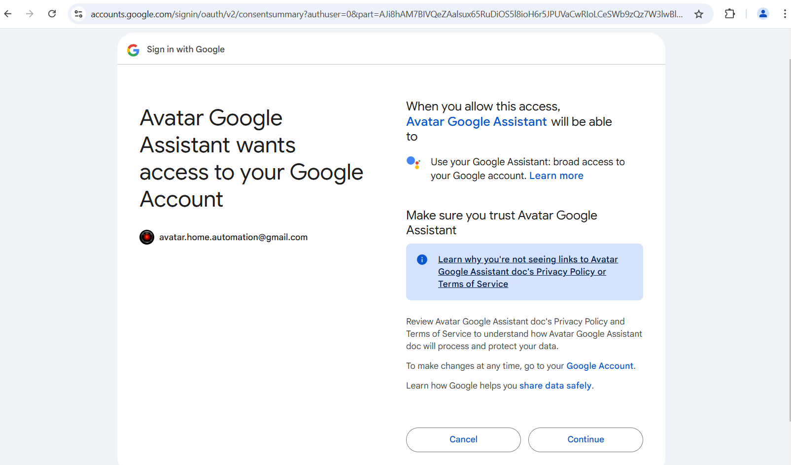{width="500"}

4. A new page appears with the authentication flow comleted.

    * You can close the window

    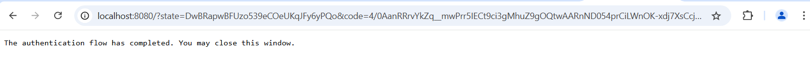{width="500"}

5. If authorization was successful, you will see in the DOS terminal a JSON response similar to the following:

    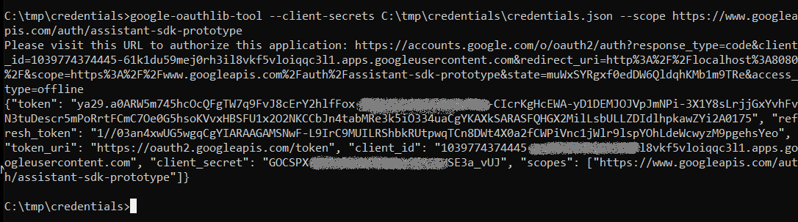{width="600"}

6. Keep this DOS terminal opened, we need to copy the "token" key in the JSON response to create the device model (see next chapter).

## Device model

To create a device model, you need two things:

*  The ID of the project ("<PROJECT ID\>") created in the step 1. `Creating a project`:
    - To find the project ID, display the project dashboard in [Google Cloud Platform](https://console.cloud.google.com)

        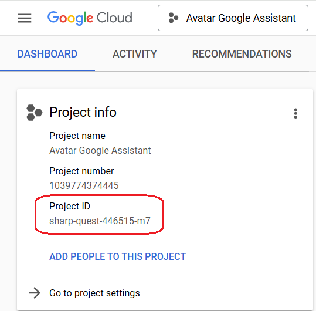{width="300"}

*  The access token ("<ACCESS TOKEN\>") created in the `Obtaining credentials` section (just below):

    - In the DOS terminal, keep the `token` key in the JSON response of the credentials obtained just below (not including the double quotes).

        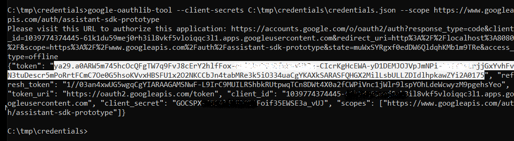{width="600"}


### Create a device model file  

1. Open your prefered editor and enter the following lines in a new file:

    ``` json
    {
    "project_id": "<PROJECT ID>",
    "device_model_id": "<PROJECT NAME>-light-v1",
    "manifest": {
        "manufacturer": "<PROJECT NAME> devices",
        "product_name": "<PROJECT NAME> light device"
    },
    "device_type": "action.devices.types.LIGHT",
    "traits": ["action.devices.traits.OnOff"]
    }
    ```

3. `project_id` key: Replace _<PROJECT ID\>_ by the ID of the project
4. `device_model_id` key: Replace _<PROJECT NAME\>_ by the name of the project
    * **IMPORTANT:** Replace the spaces with dashes (-).
5. `manufacturer` and `product_name` key: Replace _<PROJECT NAME\>_ by the name of the project
5. Save the file as `device-model.json`

    * In the same directory where the _credentials.json_ is located (e.g. _c:\tmp\credentials_)

### Create the device model

In the DOS terminal, enter the following command:

* Replace <ACCESS TOKEN\> by your access token (not including the double quotes) created in the `Obtaining credentials` section (see below).
* Replace <PROJECT ID\> by the ID of the project

```
curl -s -X POST -H "Content-Type: application/json" -H "Authorization: Bearer <ACCESS TOKEN>" -d @C:\tmp\credentials\device-model.json https://embeddedassistant.googleapis.com/v1alpha2/projects/<PROJECT ID>/deviceModels/
```

You must see the result of the creation of the device model:

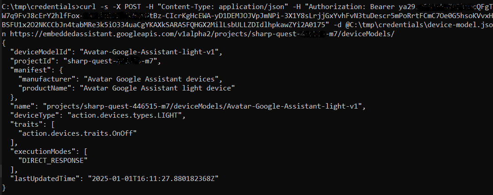{width="800"}

??? warning "Error message"
    If you see an error message:

    1. Check the project ID and the the access token in the command.
    2. Check the `device-model.json` file.

## Device model instance

### Create a device instance file

1. Open your prefered editor and enter the following lines in a new file:

    ``` json
    {
        "id": "device_avatar",
        "model_id": "<PROJECT NAME>-light-v1",
        "nickname": "My Avatar Device",
        "client_type": "SDK_SERVICE"
    }
    ```

2. Replace _<PROJECT NAME\>_ by the name of the project
    * **IMPORTANT:** Replace the spaces with dashes (-).
3. Save the file as `device-instance.json`

    * In the same directory where the _credentials.json_ is located (e.g. _c:\tmp\credentials_)

### Create the device instance

In the DOS terminal, enter the following command:

* Replace <ACCESS TOKEN\> by your access token (not including the double quotes) created in the `Obtaining credentials` section (see below).
* Replace <PROJECT ID\> by the ID of the project

```
curl -s -X POST -H "Content-Type: application/json" -H "Authorization: Bearer <ACCESS TOKEN>" -d @C:\tmp\credentials\device-instance.json https://embeddedassistant.googleapis.com/v1alpha2/projects/<PROJECT ID>/devices/
```

You must see the result of the creation of the device instance:

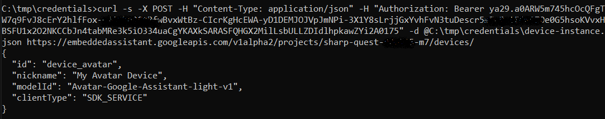{width="800"}

??? warning "Error message"
    If you see an error message:

    1. Check the project ID and the access token in the command.
    2. Check the `device-instance.json` file.

## Create an access token for the device

In the DOS terminal, enter the following command:

```
google-oauthlib-tool --client-secrets C:\tmp\credentials\credentials.json --scope https://www.googleapis.com/auth/assistant-sdk-prototype --save
```

1. Because the projet created in the step 1 is in testing mode, the following warning message appears

    * Clic the `Continue` button

    {width="500"}

2. A new page appears to grant your project access to your Google account.

    * Clic the `Continue` button

    {width="500"}

3. A new page appears with the authentication flow comleted.

    * You can close the window

    {width="500"}

4. Return to the DOS terminal to see where the _credentials.json_ file was saved

    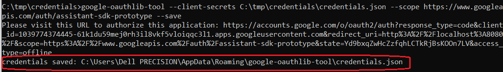{width="700"}

5. Open a Windows explorer and go to the folder 
6. Rename the _credentials.json_ to _tokens.json_
7. Copy the _tokens.json_ file to the directory where the _credentials.json_ is located. (e.g. _c:\tmp\credentials_)

